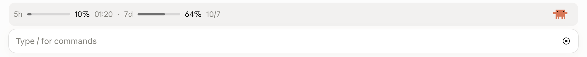

# focus-band

[English](README.md) | 中文

桌面端输入框上方常驻一栏：当前的终点 / 瓶颈 / 授权范围，以及 5h、7d 额度。



状态：0.15.0。`claude plugin validate` 通过，`claude plugin test` 15 通过。

界面有中文和英文两套：系统是中文（或以前写过中文定位）时用中文，否则用英文；`/focus lang` 可切换。

## 安装

需要支持 mods 的 Claude Code（2.1.286 及以上）。在终端里运行这一条，然后新开一个会话：

```bash
claude plugin marketplace add chaoshengsc/focus-band && claude plugin install focus-band@chaoshengsc
```

更新用 `claude plugin marketplace update chaoshengsc`，卸载用 `claude plugin uninstall focus-band@chaoshengsc`。

目录结构：`.claude-plugin/plugin.json`（清单）、`hooks/register.tsx`（全部逻辑）、`types/index.d.ts`（状态声明）、`tests/`（测试）。

## 用法

- `/focus 终点 | 瓶颈 | 范围`：改写定位；不带参数查看；`/focus clear` 清除
- `/focus style 1|2|3`：标准 / 一行 / 页脚
- `/focus lang zh|en`：界面语言；不带参数则切换
- `/focus color`：换进度条配色（桌面端点右侧小螃蟹也行）
- 模型用 `set_focus` 工具更新定位；每条提示后会附一句当前定位给模型（用户看不到）

## 已知限制（机制所限，不是待办）

- 灰色底板是桌面端画的，mod 改不了它的颜色、圆角、高度，也画不出自己那一行
- 额度来自“最近一次模型响应”，会话空闲或别的会话在消耗时会滞后于右侧面板
- 一行约 19px 高，图标超过就会撑高底板；按钮焦点框上下会被裁
- 版式 2、3 不显示范围（有意保留）

## 改动后

```bash
claude plugin validate ~/.claude/skills/focus-band
```

```bash
claude plugin test ~/.claude/skills/focus-band
```

改完要重启会话才生效。

## 许可证

MIT，见 [LICENSE](LICENSE)。小螃蟹图标是照 Claude Code 的形象画的，该形象归 Anthropic 所有，不在本许可证范围内。
